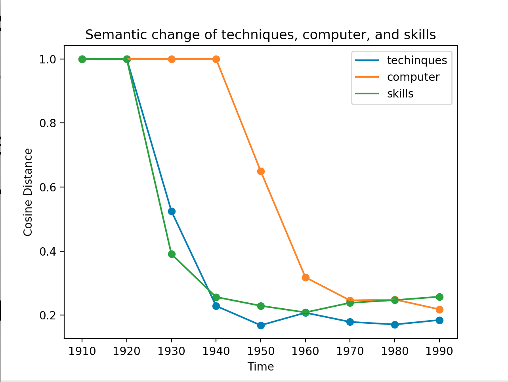

# CSC2611 Lab Report

## Information
**Name:** Angela Zavaleta

**Github Repo:** [angelazb/csc2611](https://github.com/angelazb/csc2611)

## Synchronic word embedding

**Part 1:** [Code can be found here](https://github.com/angelazb/csc2611/blob/main/Labs/lab1.py)

###  Cosine distance and Pearson correlation
After computing the cosine distance between each pair of words, I found the following Pearson correlations:

```
Pearson Correlation w2v and human: (0.9196234800170715, 0.009430945816248227)
```

We observe that the correlation of word2vec and human similarities is extremely higher compared to the LSA comparisons from the previous exercise. For the words in RG65 that are also in W, there is a correlation of 0.919. This shows that the previous models similarities did not have sufficient training data and doesn't perform as well when the data is large.

### Analogy test

Below is the accuracy on the semantic analogy test and the syntactic analogy test for w2v and LSA vectors (300). As observed, I was not able to pass any of the tests, but I assume there should have been some successful. I am not able to find why there aren't passing, but some of my observations helped with my suggestions below. As recommended, I only selected the tests that had words for both models.

```
Accuracy for word2vec semantic: 0
Accuracy for M2_300 semantic: 0
No of tests: 72

Accuracy for word2vec syntactic: 0
Accuracy for M2_300 syntactic: 0
No of tests: 1918
```

### Suggestions on how to improve the existing vecotr based models

One way of improving the exisit set of vector-based models in capturing word similarities would be also by measuring how common they are in different places. For example, there exist different analogies in different english-speaking countries that aren't used in other places as often. However, based on the context, access to those analogies might be useful. For instance, having an English user saying the word lift referring to an elevator, may not reflect is meaning if the model is mostly american, as the connection to elevator is not frequent.

Another way could be by considering words that have the same general meaning without looking at a particular form to differentiate for other words who might have other meanings could originate a more accurate approximation. For instance, we see the test: "work works play plays". Work and works could be tied to a job and the action to perform a task, but they have generally the same concept. Whereas play and plays could refer to two totally different things like the action to play but also performance (dramatic play). This is a more complicated approach as there would need to be a mix of different processings involved to be able to differentiate the meaning and group together all the instances where the words mean the same. Below are some of the instances that I got from the analysis computed:

```
dance dancing move moving
Results w2v, m2: moves, moved

dance dancing sing singing
Results w2v, m2: sang, insects

move moving walk walking
Results w2v, m2: walked, climbed

say saying dance dancing
Results w2v, m2: dances ballet
```

## Diachronic word embedding

**Part 2:** [Code can be found here](https://github.com/angelazb/csc2611/blob/main/Labs/lab1_p2.py)

### Methods for measuring degree of semantic change

The three methods proposed are the following:
- **First:** Cosine similarity between the first and last decade
- **Second:** Maximum cosine distance between each consecutive decade
- **Third:** Average cosine distance per decade change

Method | First | Second | Third
-------|-------|--------|-------
First | - | 0.68 | 0.69
Second | 0.68 | - | 0.85
Third | 0.69 | 0.85 | -

### First: Cosine similarity first to last decade Top and Least 20 changing words

```
Top 20: Cosine distance first to last decade ['techniques', 'skills', 'mcgraw', 'ml', 'programs', 'objectives', 'computer', 'radio', 'sector', 'goals', 'approach', 'van', 'shri', 'media', 'impact', 'perspective', 'patterns', 'berkeley', 'shift', 'film']
```
```
Least 20: Cosine distance first to last decade ['april', 'june', 'november', 'february', 'years', 'october', 'increase', 'january', 'century', 'months', 'daughter', 'december', 'god', 'september', 'feet', 'week', 'evening', 'door', 'payment', 'miles']
```

### Second: Maximum cosine distance Top and Least 20 changing words

```
Top 20: Max cosine distance ['computer', 'techniques', 'skills', 'shri', 'mcgraw', 'ml', 'goals', 'objectives', 'sector', 'programs', 'evaluation', 'input', 'therapy', 'wiley', 'procedures', 'jobs', 'variables', 'implications', 'radio', 'jones']
```

```
Least 20: Max cosine distance ['april', 'miles', 'november', 'september', 'january', 'december', 'february', 'university', 'vessels', 'trees', 'cent', 'solution', 'july', 'decrease', 'october', 'temperature', 'buildings', 'june', 'patients', 'blood']
```

### Third: Average cosine distance Top and Least 20 changing words

```
Top 20: Avg cosine distance ['computer', 'techniques', 'skills', 'shri', 'mcgraw', 'ml', 'goals', 'objectives', 'sector', 'programs', 'evaluation', 'input', 'therapy', 'wiley', 'procedures', 'jobs', 'variables', 'implications', 'radio', 'jones']
```

```
Least 20: Avg cosine distance ['april', 'miles', 'november', 'september', 'january', 'december', 'february', 'university', 'vessels', 'trees', 'cent', 'solution', 'july', 'decrease', 'october', 'temperature', 'buildings', 'june', 'patients', 'blood']
```

### Accuracy Evaluation

To evaluate the accuracy, I checked the closest 5 words to each other word on the first and last decade. 

```
Pearson corr: First-Last and Evaluation (0.0985356442175495, 1.0117835428817034e-05)
Pearson corr: Max and Evaluation (0.06988868598934672, 0.0017636728278709306)
Pearson corr: Avg and Evaluation (0.08020336675837121, 0.00033023915467589305)
```

### Top 3 changing words

To best detect the points of semantic change for the top three words, I plotted their cosine similarity for every year. We observe that words like computer and technology where not even used at the beigining of the century, and now tend to have one defined meaning.


